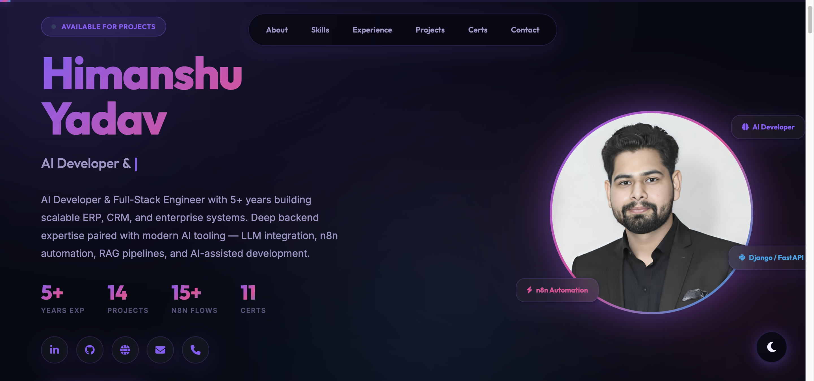

# 💼 Himanshu Yadav - Developer Resume Website

A clean, responsive HTML resume template with a coding-themed banner background and a custom profile image.

---
## 🔗 Live Demo

👉 [View Live Resume](https://himanshu263.github.io/resume/)

---

## 📸 Features

- 🖼️ Stylish header with coding/office-themed background
- 👤 Profile image support (`him.png`)
- 📱 Responsive layout using Bootstrap 5
- ⭐ Font Awesome icons for skills & social media
- ⚙️ Easy to customize and deploy

---

## 🖼️ Screenshot

---

## 📂 Folder Structure

project/
├── index.html
├── him.png
├── screenshot.png
├── README.md

---

## 🛠️ How to Use

1. Clone or download this repository.
2. Replace `him.png` with your own profile image.
3. Open `index.html` in your browser to preview.
4. Customize text, sections, skills, and links as needed.

---

## 💡 Tips

- Want a different background? Just update the CSS under `.resume-header` with a new image URL.
- Add more sections or icons using [Bootstrap 5](https://getbootstrap.com/) and [Font Awesome](https://fontawesome.com/).

---

## 📬 Contact

**Himanshu Yadav**  
📧 write.himanshu263@gmail.com  
🔗 [GitHub](https://github.com/himanshu263) | [LinkedIn](https://linkedin.com/in/himanshu263)
